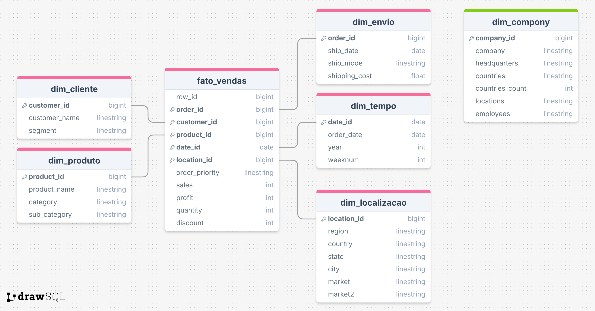

# Python-PipelineETL

> Projeto de exemplo de pipeline ETL para a base "Super Store" com criação de tabelas de dimensão e fato, análises de qualidade de dados e exemplos de carga para Google BigQuery.



## Funcionalidades Principais

- Extração e limpeza dos dados do CSV `data/superstore.csv`.
- Enriquecimento com dados externos (extrai uma tabela da Wikipedia com cadeias de supermercados).
- Geração de tabelas de dimensão: `dim_tempo`, `dim_localizacao`, `dim_envio`, `dim_cliente`, `dim_produto`, `dim_company`.
- Geração da tabela fato: `fato_vendas` com chaves de dimensão (date_id, location_id, etc.).
- Exemplos e documentação de como projetar o pipeline de atualização (sequência de atualizações, MERGE/upsert e boas práticas).
- Upload automatizável das tabelas para BigQuery (exemplos em notebook e `scripts/app.py`).

## Resultados e Conclusões

O projeto demonstra um fluxo ETL simples e reprodutível para transformar um CSV de vendas em um modelo dimensional. Inclui validações básicas de qualidade de dados (nulos, outliers, tipos), criação de tabelas de dimensão/fato e exemplos de cargas idempotentes usando MERGE/upsert.

## Tecnologias Utilizadas

- Python
- pandas, numpy
- BeautifulSoup (para scraping da Wikipedia)
- python-dotenv (carregar variáveis de ambiente)
- google-cloud-bigquery / pandas-gbq (opcional para cargas)

## Como Executar (local)

1. Clone o repositório:

   git clone https://github.com/vitoriapguimaraes/Python-PipelineETL.git

2. Entre na pasta do projeto:

   cd Python-PipelineETL

3. Crie e ative um ambiente virtual (opcional, Windows PowerShell):

   py -3 -m venv .venv; .\.venv\Scripts\Activate.ps1

4. Instale as dependências:

   pip install pandas numpy python-dotenv beautifulsoup4 google-cloud-bigquery pandas-gbq

5. Execute o notebook de desenvolvimento:

   Abra `scripts/main.ipynb` no Jupyter / VS Code e execute as células na ordem.

6. (Opcional) Execute o script principal para gerar e carregar tabelas (requer credenciais GCP):

   python scripts/app.py

## Configuração para BigQuery (opcional)

- Crie um serviço de conta no GCP e baixe o JSON de credenciais.
- Defina a variável de ambiente `GOOGLE_APPLICATION_CREDENTIALS` apontando para o arquivo JSON.
- Defina `PROJECT_ID` e (opcionalmente) `DATASET_NAME` no arquivo `.env` ou nas variáveis de ambiente.

## Estrutura de Diretórios

```
Python-PipelineETL/
├── data/                      # CSVs de entrada
│   └── superstore.csv
├── results/                   # Imagens, gráficos e artefatos
├── scripts/                   # Notebook e scripts Python
│   ├── main.ipynb
│   └── app.py
├── keys/                      # Chave de serviço
├── README.md
└── LICENSE
```

## Pipeline de atualização das tabelas (resumo)

- Ordem recomendada: `dim_tempo` → `dim_company` → `dim_produto` → `dim_cliente` → `dim_localizacao` → `dim_envio` → `fato_vendas`.
- Use tabelas de staging para validar e deduplicar antes do MERGE/upsert.
- Decida SCD1 vs SCD2 para dimensões (por exemplo, `dim_cliente` pode usar SCD2).
- Exemplos de MERGE para BigQuery e upsert em pandas estão documentados no notebook `scripts/main.ipynb`.

## Status

- ✅ Concluído

> Veja as [issues abertas](https://github.com/vitoriapguimaraes/Python-PipelineETL/issues) para sugestões de melhorias e próximos passos.

## Mais Sobre Mim

A autora do projeto: Vitoria — veja mais projetos em https://github.com/vitoriapguimaraes
